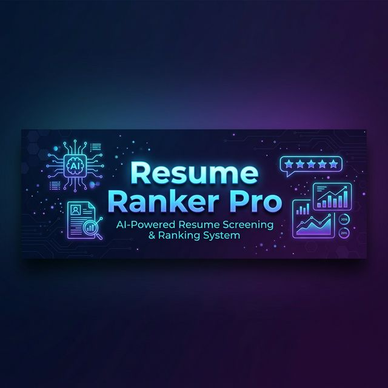
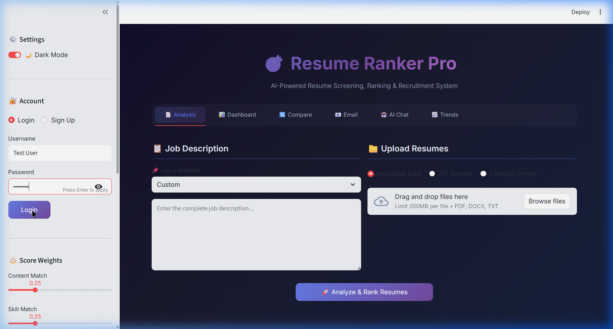
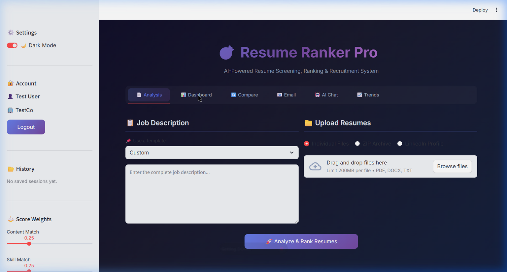
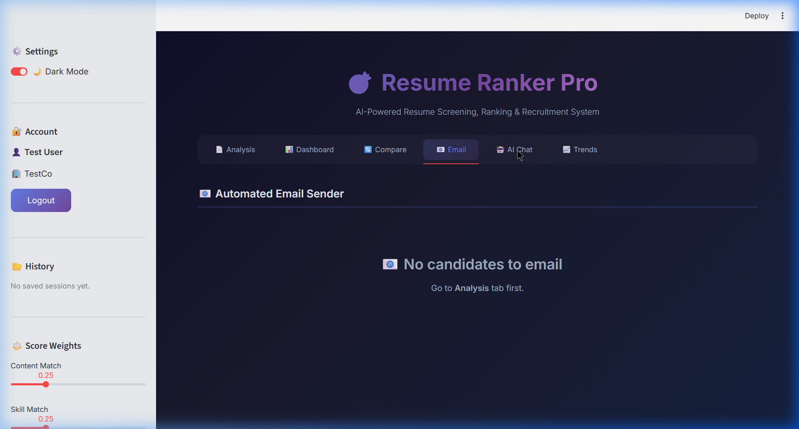
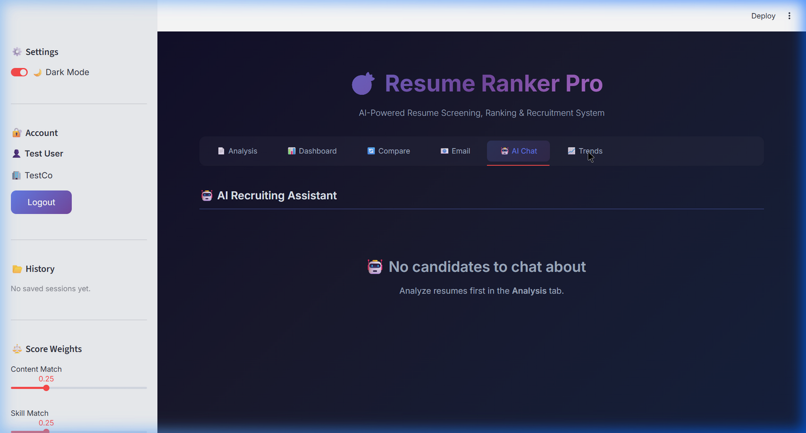

<p align="center">
  
</p>

<h1 align="center">🎯 Resume Ranker Pro</h1>
<h3 align="center">AI-Powered Resume Screening, Ranking & Recruitment System</h3>

<p align="center">
  
  
  
  
</p>

<p align="center">
  <b>An intelligent recruitment tool that automates resume screening using NLP, TF-IDF scoring, and Google Gemini AI to help recruiters find the best candidates faster.</b>
</p>

---

## 📸 Screenshots

<p align="center">
  
  <br><em>📄 Analysis Tab — Upload resumes, select JD templates, and analyze candidates</em>
</p>

<p align="center">
  
  <br><em>📊 Dashboard — Interactive charts, skill gap analysis, and diversity analytics</em>
</p>

<p align="center">
  
  <br><em>📧 Email — Automated candidate notification with customizable templates</em>
</p>

<p align="center">
  
  <br><em>🤖 AI Chat — Ask questions about candidates using Gemini AI</em>
</p>

<p align="center">
  
  <br><em>📈 Trends — Historical screening data and performance tracking</em>
</p>

---

## 🚀 What is Resume Ranker Pro?

Resume Ranker Pro is a **full-stack AI-powered recruitment tool** that solves one of the biggest challenges in hiring: **screening hundreds of resumes quickly and fairly**. It uses Natural Language Processing (NLP), TF-IDF vectorization, cosine similarity, and Google Gemini AI to:

- **Parse** resumes from PDF, DOCX, and TXT formats
- **Rank** candidates against job descriptions using 6 scoring dimensions
- **Eliminate bias** through anonymized screening mode
- **Generate insights** with AI explanations, salary estimates, and improvement feedback
- **Automate communication** with templated emails to candidates

---

## 🌍 Real-World Problems This Project Solves

| Problem | How Resume Ranker Pro Solves It |
|---------|-------------------------------|
| **⏰ Time-consuming manual screening** | Automates resume parsing and ranking — screens 100+ resumes in seconds instead of hours |
| **🎯 Inconsistent evaluation criteria** | Uses standardized scoring across 6 dimensions (content, skills, formatting, experience, education, culture fit) |
| **🚫 Unconscious bias in hiring** | Anonymize mode strips names, gender, age, and contact info for blind hiring |
| **📊 Lack of data-driven decisions** | Interactive dashboards with score distributions, skill gaps, and diversity analytics |
| **💬 Poor candidate communication** | Automated AI-generated emails with customizable templates for mass outreach |
| **📈 No historical tracking** | Session history and trends dashboard to track recruitment patterns over time |
| **💰 Expensive ATS software** | Free, open-source alternative with features matching $500+/month ATS tools |
| **🔍 Missing soft skills analysis** | Detects soft skills, culture fit indicators, and communication patterns |

---

## 🏗️ Project Structure

```
resume-ranker-pro/
│
├── 📄 app.py                  # Main Streamlit application (1300+ lines)
│                               # - UI layout with 6 tabs
│                               # - AI functions (Gemini integration)
│                               # - PDF report generator
│                               # - Email automation
│                               # - All interactive features
│
├── 📄 resume_parser.py         # Resume parsing & NLP engine
│                               # - PDF/DOCX/TXT text extraction
│                               # - Skill & soft skill extraction
│                               # - Contact info extraction
│                               # - Language detection & translation
│                               # - Bias indicator detection
│                               # - Resume anonymizer
│                               # - LinkedIn profile parser
│                               # - ZIP archive handler
│
├── 📄 resume_ranker.py         # Scoring & ranking engine
│                               # - TF-IDF vectorization
│                               # - Cosine similarity matching
│                               # - 6-dimension scoring algorithm
│                               # - Custom weight support
│                               # - Keyword analysis
│
├── 📄 database.py              # SQLite database layer
│                               # - User authentication
│                               # - Session management
│                               # - Custom skills storage
│                               # - Trend data persistence
│
├── 📄 requirements.txt         # Python dependencies (15 packages)
├── 📄 README.md                # Project documentation (this file)
├── 📄 SRS_Report.md            # Software Requirements Specification
├── 📁 screenshots/             # Application screenshots
│   ├── banner.png
│   ├── homepage.png
│   ├── dashboard.png
│   ├── email.png
│   ├── ai_chat.png
│   ├── trends.png
│   └── sidebar.png
└── 📄 resume_ranker.db         # SQLite database (auto-created)
```

---

## ✨ Features (26 Total)

### 🔬 Core Analysis Engine
| Feature | Description |
|---------|-------------|
| **📄 Multi-format Parser** | Extracts text from PDF, DOCX, and TXT resume files |
| **🔧 Skill Extraction** | Identifies 100+ technical and soft skills from resume text |
| **📊 6-Dimension Scoring** | Content match, skill match, formatting, experience, education, culture fit |
| **⚖️ Custom Weights** | Adjustable importance sliders for each scoring dimension |
| **🔑 Keyword Analysis** | Shows matched and missing keywords against job description |
| **📋 JD Templates** | 8 pre-built job description templates for common roles |

### 🤖 AI-Powered Features (Google Gemini)
| Feature | Description |
|---------|-------------|
| **📝 AI Resume Summary** | Auto-generates concise candidate summaries |
| **💡 AI Improvement Feedback** | Suggests specific resume improvements for each candidate |
| **🧠 AI Score Explanation** | Explains WHY a candidate scored high or low |
| **💰 Salary Estimator** | AI-powered salary range estimation per candidate |
| **✉️ AI Email Generator** | Creates personalized acceptance/rejection emails |
| **💬 AI Chat Assistant** | Interactive chatbot to ask questions about candidates |

### 📊 Analytics & Visualization
| Feature | Description |
|---------|-------------|
| **📈 Interactive Dashboard** | Score distribution, top skills, radar charts, heatmaps |
| **🌍 Diversity Analytics** | Education, experience, and score tier distribution pie charts |
| **🔄 A/B JD Testing** | Compare candidate rankings across two different job descriptions |
| **📈 Trends Dashboard** | Track recruitment metrics over multiple sessions |

### 🛡️ Ethics & Compliance
| Feature | Description |
|---------|-------------|
| **🔒 Anonymize Mode** | Blind hiring — strips all identifying information |
| **⚠️ Bias Detection** | Flags potential bias indicators in resumes |
| **🤝 Culture Fit Scoring** | Objective soft-skill and culture alignment measurement |

### 📋 Recruitment Workflow
| Feature | Description |
|---------|-------------|
| **✅ Shortlisting** | Mark candidates as Shortlisted or Rejected |
| **📝 Recruiter Notes** | Add private notes per candidate |
| **🏷️ Candidate Tags** | Label candidates (Strong Fit, Senior, Top Pick, etc.) |
| **⬆️⬇️ Manual Reranking** | Override AI rankings by moving candidates up/down |
| **📧 Automated Emails** | Bulk email with recruiter notification |
| **📋 Email Templates** | Editable templates for Qualified, Not Qualified, On Hold |

### 📥 Export & Reports
| Feature | Description |
|---------|-------------|
| **📄 PDF Report** | Multi-page professional PDF with rankings and score breakdowns |
| **📊 Excel Report** | Detailed XLSX with multiple sheets |
| **📥 CSV Export** | Quick data export with tags, notes, and status |

---

## 🛠️ Tech Stack

| Layer | Technology |
|-------|-----------|
| **Frontend** | Streamlit (Python web framework) |
| **AI/ML** | Google Gemini AI, scikit-learn (TF-IDF), cosine similarity |
| **NLP** | Regex-based extraction, keyword matching, bias detection |
| **Database** | SQLite3 with secure password hashing |
| **Visualization** | Plotly (interactive charts), Streamlit native components |
| **PDF Processing** | PyPDF2 (reading), FPDF2 (generating) |
| **Document Parsing** | python-docx (DOCX files) |
| **Email** | smtplib + MIME (Gmail SMTP) |
| **Translation** | deep-translator (multi-language support) |
| **Web Scraping** | BeautifulSoup4 (LinkedIn profile parsing) |

---

## 📦 Installation & Setup

### Prerequisites
- Python 3.10+
- Google Gemini API Key ([Get one free](https://makersuite.google.com/app/apikey))

### Quick Start

```bash
# 1. Clone the repository
git clone https://github.com/yourusername/resume-ranker-pro.git
cd resume-ranker-pro

# 2. Install dependencies
pip install -r requirements.txt

# 3. Set your Gemini API key (in app.py or as environment variable)
# Edit line 24 in app.py: GEMINI_API_KEY = "your-api-key-here"

# 4. Run the application
streamlit run app.py
```

### Environment Variables (Optional)
```bash
GEMINI_API_KEY=your-gemini-api-key
SENDER_EMAIL=your-gmail@gmail.com
SENDER_PASSWORD=your-app-password
```

---

## 🎮 How to Use

1. **Upload Resumes** — Drag & drop PDF/DOCX/TXT files (or use ZIP batch upload)
2. **Enter Job Description** — Type or select from 8 pre-built templates
3. **Adjust Weights** — Customize scoring priorities in the sidebar
4. **Click Analyze** — AI ranks all candidates in seconds
5. **Review Results** — View scores, skills, keyword matches, and AI explanations
6. **Take Action** — Shortlist, tag, add notes, and send automated emails
7. **Export** — Download PDF, Excel, or CSV reports

---

## 📚 Key Algorithms

### TF-IDF + Cosine Similarity
The core ranking uses **Term Frequency-Inverse Document Frequency** to convert resumes and job descriptions into numerical vectors, then measures similarity using **cosine distance**. This gives a content match score between 0-100%.

### Multi-Dimensional Scoring
Each candidate is scored across 6 weighted dimensions:
```
Final Score = w₁(Content) + w₂(Skills) + w₃(Format) + w₄(Experience) + w₅(Education) + w₆(Culture Fit)
```
Where weights are user-adjustable and automatically normalized to sum to 1.0.

### Bias Detection
A regex-based system scans for gender-coded language, age indicators, marital status, and other protected characteristics, flagging them for the recruiter's awareness.

---

## 🤝 Contributing

Contributions are welcome! Feel free to:
- 🐛 Report bugs via Issues
- 💡 Suggest features via Discussions
- 🔧 Submit PRs with improvements

---

## 📜 License

This project is licensed under the **MIT License** — free for personal and commercial use.

---

<p align="center">
  <b>Built with ❤️ using Python, Streamlit, and Google Gemini AI</b><br>
  <sub>⭐ Star this repo if you find it useful!</sub>
</p>
